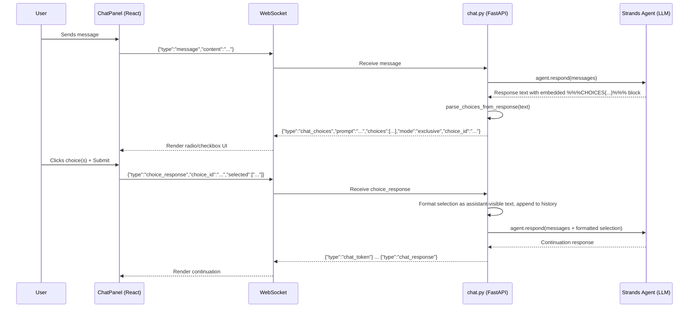

# Design Document: Interactive Chat Choices

## Overview

Enable the LLM to present structured multiple-choice questions to the user within the chat UI. The system supports two selection modes: exclusive (radio — pick one) and multiple (checkbox — pick many). The LLM embeds a structured JSON block in its response text, the backend detects and parses it into a dedicated WebSocket event, the frontend renders interactive choice widgets, and the user's selection is sent back as a structured response that the agent can continue reasoning from.

## Main Algorithm/Workflow



## Core Interfaces/Types

### Backend (Python)

```python
from dataclasses import dataclass
from typing import Literal
import uuid
import json
import re

# --- Data Models ---

@dataclass
class Choice:
    """A single selectable option."""
    label: str          # Display text shown to the user
    value: str          # Machine-readable value sent back on selection

@dataclass
class ChoicePrompt:
    """A structured choice prompt extracted from LLM output."""
    choice_id: str                          # Unique ID for correlating response
    prompt: str                             # Question text displayed above choices
    choices: list[Choice]                   # Available options
    mode: Literal["exclusive", "multiple"]  # Selection mode

@dataclass
class ChoiceResponse:
    """User's selection sent back from the frontend."""
    choice_id: str       # Correlates to the ChoicePrompt
    selected: list[str]  # List of selected `value` strings
```

### Frontend (TypeScript)

```typescript
// --- Data Models ---

interface Choice {
  label: string   // Display text
  value: string   // Machine value
}

interface ChoicePromptMessage {
  type: 'chat_choices'
  choice_id: string
  prompt: string
  choices: Choice[]
  mode: 'exclusive' | 'multiple'
  session_id: string
}

interface ChatMessage {
  role: 'user' | 'assistant'
  content: string
  language: string
  // Extended fields for choice messages
  choicePrompt?: {
    choice_id: string
    prompt: string
    choices: Choice[]
    mode: 'exclusive' | 'multiple'
  }
  choiceResponse?: {
    choice_id: string
    selected: string[]
  }
  answered?: boolean  // True once user has submitted their selection
}
```

## Key Functions with Formal Specifications

### Function 1: `parse_choices_from_response(text: str) -> tuple[str, ChoicePrompt | None]`

```python
CHOICES_PATTERN = re.compile(
    r"%%%CHOICES\s*(\{.*?\})\s*%%%",
    re.DOTALL,
)

def parse_choices_from_response(text: str) -> tuple[str, ChoicePrompt | None]:
    """Extract a ChoicePrompt from the LLM response text, if present.

    Returns the cleaned text (with the marker removed) and the parsed
    ChoicePrompt, or None if no valid marker was found.
    """
```

**Preconditions:**
- `text` is a non-null string (may be empty)

**Postconditions:**
- If `text` contains a valid `%%%CHOICES{...}%%%` block:
  - Returns `(cleaned_text, ChoicePrompt)` where `cleaned_text` has the marker removed
  - `ChoicePrompt.choice_id` is a non-empty UUID string
  - `ChoicePrompt.choices` has at least 2 items
  - `ChoicePrompt.mode` is either `"exclusive"` or `"multiple"`
  - Each `Choice.value` is unique within the list
- If `text` does not contain a valid marker or JSON is malformed:
  - Returns `(text, None)` — original text unchanged
- The function never raises; malformed markers are silently ignored

---

### Function 2: `validate_choice_response(response: ChoiceResponse, prompt: ChoicePrompt) -> bool`

```python
def validate_choice_response(
    response: ChoiceResponse, prompt: ChoicePrompt
) -> bool:
    """Validate that a user's choice response is consistent with the prompt."""
```

**Preconditions:**
- `response` and `prompt` are non-null
- `response.choice_id == prompt.choice_id`

**Postconditions:**
- Returns `True` if and only if:
  - All values in `response.selected` exist in `prompt.choices` (by value)
  - `len(response.selected) >= 1`
  - If `prompt.mode == "exclusive"`: `len(response.selected) == 1`
  - If `prompt.mode == "multiple"`: `len(response.selected) >= 1`
- Returns `False` otherwise
- No side effects

---

### Function 3: `format_choice_as_message(response: ChoiceResponse, prompt: ChoicePrompt) -> str`

```python
def format_choice_as_message(
    response: ChoiceResponse, prompt: ChoicePrompt
) -> str:
    """Format the user's choice selection as a human-readable message
    to be appended to conversation history so the agent can see it."""
```

**Preconditions:**
- `response` has been validated against `prompt`

**Postconditions:**
- Returns a non-empty string like: `"User selected: Option A, Option B"`
- Uses `Choice.label` (not value) for readability
- The returned string is suitable for inclusion in conversation history as a user message

---

### Function 4: Frontend `ChoiceWidget` Component

```typescript
interface ChoiceWidgetProps {
  choiceId: string
  prompt: string
  choices: Choice[]
  mode: 'exclusive' | 'multiple'
  answered: boolean
  onSubmit: (choiceId: string, selected: string[]) => void
}

function ChoiceWidget({
  choiceId, prompt, choices, mode, answered, onSubmit
}: ChoiceWidgetProps): JSX.Element
```

**Preconditions:**
- `choices.length >= 2`
- `mode` is `"exclusive"` or `"multiple"`
- `onSubmit` is a valid callback

**Postconditions:**
- Renders radio buttons when `mode === "exclusive"`, checkboxes when `mode === "multiple"`
- Submit button is disabled until at least one option is selected
- After submission (`answered === true`), all inputs are disabled and selection is visually locked
- Calls `onSubmit(choiceId, selectedValues)` exactly once on submit
- Accessible: uses `<fieldset>`, `<legend>`, proper `<label>` associations, and `role="group"`

## Algorithmic Pseudocode

### Backend: WebSocket Message Handler (Extended)

```python
# Inside ws_chat(), after receiving data from websocket:

async def handle_incoming_message(data: dict, context: ConversationContext, websocket: WebSocket):
    msg_type = data.get("type")

    if msg_type == "choice_response":
        # --- Handle user's choice selection ---
        choice_id = data.get("choice_id", "")
        selected = data.get("selected", [])

        # Look up the pending choice prompt
        pending = context.pending_choices.get(choice_id)
        if pending is None:
            await websocket.send_json({
                "type": "error",
                "content": f"Unknown or expired choice_id: {choice_id}",
                "session_id": context.session_id,
            })
            return

        response = ChoiceResponse(choice_id=choice_id, selected=selected)

        if not validate_choice_response(response, pending):
            await websocket.send_json({
                "type": "error",
                "content": "Invalid choice selection",
                "session_id": context.session_id,
            })
            return

        # Format selection as user message and continue conversation
        user_text = format_choice_as_message(response, pending)
        del context.pending_choices[choice_id]

        context.messages.append(ChatMessage(role="user", content=user_text))
        await mm.persist_message(context.session_id, "user", user_text)

        # Continue agent conversation with the selection
        agent_messages = [{"role": m.role, "content": m.content} for m in context.messages]
        response_text = await context.agent.respond(agent_messages)

        # Process response (may contain another choice prompt)
        await send_agent_response(response_text, context, websocket)

    elif msg_type == "message":
        # --- Existing message handling (unchanged) ---
        # ... existing code ...
        response_text = await context.agent.respond(agent_messages)
        await send_agent_response(response_text, context, websocket)


async def send_agent_response(
    response_text: str, context: ConversationContext, websocket: WebSocket
):
    """Process agent response: detect choices or stream plain text."""
    cleaned_text, choice_prompt = parse_choices_from_response(response_text)

    if choice_prompt is not None:
        # Store pending choice for validation on response
        context.pending_choices[choice_prompt.choice_id] = choice_prompt

        # Send any preamble text as tokens
        if cleaned_text.strip():
            for token in cleaned_text.split(" "):
                await websocket.send_json({
                    "type": "chat_token",
                    "content": token,
                    "session_id": context.session_id,
                })

        # Send the structured choice event
        await websocket.send_json({
            "type": "chat_choices",
            "choice_id": choice_prompt.choice_id,
            "prompt": choice_prompt.prompt,
            "choices": [{"label": c.label, "value": c.value} for c in choice_prompt.choices],
            "mode": choice_prompt.mode,
            "session_id": context.session_id,
        })

        # Record the choice prompt in history as an assistant message
        context.messages.append(ChatMessage(role="assistant", content=cleaned_text))
        await mm.persist_message(context.session_id, "assistant", cleaned_text)
    else:
        # Standard streaming response (existing behavior)
        tokens = response_text.split(" ")
        for i, token in enumerate(tokens):
            partial = token if i == 0 else " " + token
            await websocket.send_json({
                "type": "chat_token",
                "content": partial,
                "session_id": context.session_id,
            })

        await websocket.send_json({
            "type": "chat_response",
            "content": response_text,
            "session_id": context.session_id,
        })

        context.messages.append(ChatMessage(role="assistant", content=response_text))
        await mm.persist_message(context.session_id, "assistant", response_text)
```

### Frontend: Choice Event Handling

```typescript
// Inside ChatPanel's ws.onmessage handler:

if (eventType === 'chat_choices') {
  const choiceData = raw as ChoicePromptMessage
  setThinking(false)
  streamBufferRef.current = ''

  // Append as an assistant message with choice metadata
  const choiceMessage: ChatMessage = {
    role: 'assistant',
    content: choiceData.prompt,
    language,
    choicePrompt: {
      choice_id: choiceData.choice_id,
      prompt: choiceData.prompt,
      choices: choiceData.choices,
      mode: choiceData.mode,
    },
    answered: false,
  }
  setMessages(prev => [...prev, choiceMessage])
}

// Handler for when user submits a choice
function handleChoiceSubmit(choiceId: string, selected: string[]) {
  if (!wsRef.current || wsRef.current.readyState !== WebSocket.OPEN) return

  // Mark the choice message as answered
  setMessages(prev =>
    prev.map(msg =>
      msg.choicePrompt?.choice_id === choiceId
        ? { ...msg, answered: true, choiceResponse: { choice_id: choiceId, selected } }
        : msg
    )
  )

  // Send selection to backend
  wsRef.current.send(JSON.stringify({
    type: 'choice_response',
    choice_id: choiceId,
    selected,
  }))

  setThinking(true)
}
```

### LLM Marker Format

The LLM is instructed (via system prompt augmentation) to embed choices using this format:

```
Here are some options for you to choose from:

%%%CHOICES
{
  "prompt": "Which database would you prefer?",
  "choices": [
    {"label": "PostgreSQL", "value": "postgresql"},
    {"label": "MySQL", "value": "mysql"},
    {"label": "SQLite", "value": "sqlite"}
  ],
  "mode": "exclusive"
}
%%%
```

The `choice_id` is NOT generated by the LLM — it is assigned server-side by `parse_choices_from_response()` using `uuid.uuid4()`. This prevents the LLM from producing duplicate or predictable IDs.

## Example Usage

### Backend: Parsing a response

```python
raw_response = """I can help you set up a database. Let me know your preference:

%%%CHOICES
{
  "prompt": "Which database engine would you like to use?",
  "choices": [
    {"label": "PostgreSQL - Best for complex queries", "value": "postgresql"},
    {"label": "MySQL - Great for web applications", "value": "mysql"},
    {"label": "SQLite - Lightweight, no server needed", "value": "sqlite"}
  ],
  "mode": "exclusive"
}
%%%"""

cleaned, choice_prompt = parse_choices_from_response(raw_response)

assert cleaned.strip() == "I can help you set up a database. Let me know your preference:"
assert choice_prompt is not None
assert choice_prompt.mode == "exclusive"
assert len(choice_prompt.choices) == 3
assert choice_prompt.choices[0].value == "postgresql"
```

### Backend: Validating a response

```python
response = ChoiceResponse(choice_id=choice_prompt.choice_id, selected=["postgresql"])
assert validate_choice_response(response, choice_prompt) is True

# Invalid: multiple selections in exclusive mode
bad_response = ChoiceResponse(choice_id=choice_prompt.choice_id, selected=["postgresql", "mysql"])
assert validate_choice_response(bad_response, choice_prompt) is False

# Invalid: unknown value
bad_response2 = ChoiceResponse(choice_id=choice_prompt.choice_id, selected=["mongodb"])
assert validate_choice_response(bad_response2, choice_prompt) is False
```

### Frontend: Rendering choices

```tsx
{/* Inside message rendering loop */}
{msg.choicePrompt && (
  <ChoiceWidget
    choiceId={msg.choicePrompt.choice_id}
    prompt={msg.choicePrompt.prompt}
    choices={msg.choicePrompt.choices}
    mode={msg.choicePrompt.mode}
    answered={msg.answered ?? false}
    onSubmit={handleChoiceSubmit}
  />
)}
```

### Multiple selection example

```python
raw = """Select the toppings you want:

%%%CHOICES
{
  "prompt": "Choose your pizza toppings:",
  "choices": [
    {"label": "Pepperoni", "value": "pepperoni"},
    {"label": "Mushrooms", "value": "mushrooms"},
    {"label": "Olives", "value": "olives"},
    {"label": "Extra Cheese", "value": "extra_cheese"}
  ],
  "mode": "multiple"
}
%%%"""

cleaned, prompt = parse_choices_from_response(raw)
assert prompt.mode == "multiple"

# Valid: multiple selections allowed
response = ChoiceResponse(choice_id=prompt.choice_id, selected=["pepperoni", "olives"])
assert validate_choice_response(response, prompt) is True
```

## Correctness Properties

1. **Parsing round-trip**: For any valid `%%%CHOICES{...}%%%` block embedded in text, `parse_choices_from_response` extracts a `ChoicePrompt` with all fields populated, and the cleaned text does not contain the marker.

2. **Idempotent choice IDs**: Each call to `parse_choices_from_response` generates a unique `choice_id` (UUID4), even for identical input text.

3. **Exclusive mode constraint**: `validate_choice_response` returns `False` whenever `mode == "exclusive"` and `len(selected) != 1`.

4. **Multiple mode constraint**: `validate_choice_response` returns `False` whenever `len(selected) == 0`.

5. **Value domain constraint**: `validate_choice_response` returns `False` if any value in `selected` is not present in the prompt's `choices[].value` set.

6. **Graceful degradation**: If the LLM produces malformed JSON inside the markers, `parse_choices_from_response` returns `(original_text, None)` — the message is delivered as plain text.

7. **Choice state immutability**: Once a `ChoiceWidget` is submitted (`answered === true`), the UI disables all inputs and the `onSubmit` callback cannot fire again.

8. **Pending choice cleanup**: After a valid `choice_response` is processed, the corresponding entry is removed from `context.pending_choices`, preventing replay.

9. **Conversation continuity**: The formatted choice selection is appended to conversation history as a user message, so the agent sees it in subsequent turns and can reason about the user's selection.

10. **Accessibility**: The `ChoiceWidget` uses semantic HTML (`<fieldset>`, `<legend>`, `<label>`, `role="group"`) and supports keyboard navigation.
