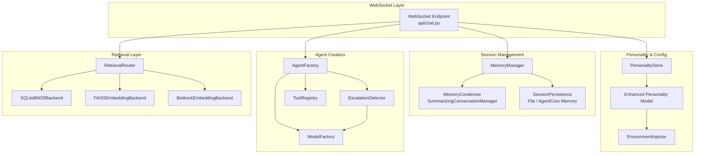

# Design Document: Smart Chat Strands

## Overview

This design upgrades the INTENT chat system from a stateless, single-model WebSocket endpoint into a persistent, retrieval-augmented, multi-personality chat platform built on the Strands Agents SDK. The key capabilities are:

1. **Persistent conversation memory** using Strands SDK `session_manager` and `SummarizingConversationManager` for context compression, with file-based fallback.
2. **Enhanced personality model** with retrieval backends, primary/fallback model assignments, environment data injection, and fine-grained retrieval access controls.
3. **Multi-backend retrieval** via a Retrieval Router that concurrently queries SQLite BM25 (FTS5) and FAISS-based embedding backends (sentence-transformers or Bedrock Titan/Nova), merges and deduplicates results, and injects them into agent context.
4. **Model escalation** with complexity heuristics and automatic retry-on-error from primary to fallback model.
5. **Full Strands SDK tool integration** with runtime tool registration and personality-based filtering.
6. **Graceful degradation** when any optional dependency (Strands SDK, SQLite, FAISS, Bedrock) is unavailable.

The design preserves all existing architectural patterns: optional imports with fallbacks, dependency injection, personality-based access control via `invocation_state`, WebSocket streaming, and structured logging.

## Architecture



### Key Architectural Decisions

1. **SummarizingConversationManager for condensation**: The Strands SDK provides `SummarizingConversationManager` which handles context overflow by summarizing older messages. We use this as the Memory_Condenser rather than building a custom solution. The `summary_ratio` and `preserve_recent_messages` parameters map directly to our configurable condensation requirements.

2. **File-based session persistence as default**: Rather than requiring AgentCore Memory (which needs AWS infrastructure), the default `session_manager` implementation uses local JSON files. This keeps the system functional in minimal environments while allowing an upgrade path to AgentCore Memory.

3. **Retrieval Router as a standalone component**: Retrieval is decoupled from the agent itself. The router queries backends concurrently, merges results, and injects them into the system prompt before the agent processes the message. This avoids coupling retrieval logic to the Strands Agent internals.

4. **Escalation via wrapper, not agent replacement**: The EscalationDetector evaluates the message before agent invocation. If escalation is needed, a second agent instance with the fallback model is created (or cached). This avoids mid-conversation agent swaps and keeps the primary agent's conversation state intact.

5. **Backward-compatible personality model**: New fields (`retrieval_backends`, `primary_model`, `fallback_model`, `env_data_sources`, `allowed_retrieval_indexes`) are optional with sensible defaults. Existing personality JSON files continue to work unchanged, with `allowed_faiss_indexes` automatically mapped to the new retrieval ACL format.

## Components and Interfaces

### 1. MemoryManager

**Location**: `backend/app/services/memory_manager.py`

Manages conversation persistence and condensation for chat sessions.

```python
class MemoryManager:
    """Manages conversation memory persistence and condensation."""

    def __init__(
        self,
        storage_dir: Path,
        condense_every_n_turns: int = 10,
        token_threshold: int = 4000,
        summary_ratio: float = 0.3,
        preserve_recent: int = 10,
    ) -> None: ...

    async def persist_message(
        self, session_id: str, role: str, content: str
    ) -> None:
        """Persist a message to durable storage before response is sent."""

    async def restore_history(
        self, session_id: str
    ) -> list[dict[str, str]]:
        """Restore full conversation history from durable storage."""

    async def maybe_condense(
        self, session_id: str
    ) -> bool:
        """Run condensation if turn count or token threshold exceeded.
        Returns True if condensation occurred."""

    def create_conversation_manager(
        self,
    ) -> "SummarizingConversationManager | None":
        """Create a Strands SummarizingConversationManager instance,
        or None if Strands SDK is unavailable."""
```

**Persistence format**: Each session is stored as a JSON file at `{storage_dir}/{session_id}.json` containing `{"messages": [...], "metadata": {...}}`.

### 2. Enhanced Personality Model

**Location**: `backend/app/models/personality.py` (extended)

```python
@dataclass
class RetrievalBackendConfig:
    """Configuration for a single retrieval backend."""
    backend_type: str  # "sqlite_bm25" | "faiss_embedding" | "bedrock_embedding"
    # SQLite BM25 fields
    db_path: str | None = None
    fts_table: str | None = None
    ranking_algorithm: str = "bm25_okapi"  # "bm25_okapi" | "bm25f"
    # FAISS/Bedrock fields
    index_path: str | None = None
    embedding_model: str | None = None  # sentence-transformer model or Bedrock model ID
    # Common
    top_k: int = 5
    name: str = ""

@dataclass
class ModelConfig:
    """Configuration for a model provider."""
    provider_type: str = "bedrock"
    model_id: str = ""
    inference_profile_id: str | None = None
    endpoint: str | None = None
    api_key: str | None = None
    region: str | None = None
    temperature: float = 0.7
    max_tokens: int = 2048

@dataclass
class RetrievalACLEntry:
    """Access control entry for a retrieval backend."""
    backend_type: str  # "sqlite_bm25" | "faiss_embedding" | "bedrock_embedding"
    index_name: str  # db_path for SQLite, index name for FAISS/Bedrock

@dataclass
class PersonalityAccess:
    """Extended access controls."""
    allowed_tools: list[str] = field(default_factory=list)
    allowed_read_roots: list[str] | None = None
    allowed_write_roots: list[str] | None = None
    allowed_faiss_indexes: list[int] | None = None  # backward compat
    allowed_retrieval_indexes: list[RetrievalACLEntry] | None = None

@dataclass
class Personality:
    id: str
    name: str
    description: str
    system_prompt: str
    instructions: str = ""
    access: PersonalityAccess = field(default_factory=PersonalityAccess)
    # New fields
    retrieval_backends: list[RetrievalBackendConfig] = field(default_factory=list)
    primary_model: ModelConfig | None = None
    fallback_model: ModelConfig | None = None
    env_data_sources: list[str] = field(default_factory=list)
```

### 3. SQLiteBM25Backend

**Location**: `backend/app/engine/sqlite_bm25_backend.py`

```python
@dataclass
class BM25Result:
    document_fragment: str
    score: float
    source: str

class SQLiteBM25Backend:
    """Queries SQLite FTS5 tables with BM25 ranking."""

    def __init__(
        self, db_path: str, fts_table: str, ranking_algorithm: str = "bm25_okapi"
    ) -> None: ...

    async def query(self, query_text: str, top_k: int = 5) -> list[BM25Result]:
        """Execute FTS5 search with BM25 ranking, return top-k results."""

    def is_available(self) -> bool:
        """Check if the database and FTS5 table exist and are queryable."""
```

The backend uses `sqlite3` (stdlib) with FTS5 `MATCH` queries. BM25 Okapi uses the default `bm25()` function. BM25F uses column-weighted `bm25()` with per-column boost parameters from the config.

### 4. BedrockEmbeddingBackend

**Location**: `backend/app/engine/bedrock_embedding_backend.py`

```python
class BedrockEmbeddingBackend:
    """Generates embeddings via Bedrock and searches FAISS indexes."""

    def __init__(
        self,
        model_id: str,  # e.g. "amazon.titan-embed-text-v2:0"
        index_path: str,
        region: str | None = None,
        top_k: int = 5,
    ) -> None: ...

    async def query(self, query_text: str, top_k: int = 5) -> list[SimilarityResult]:
        """Generate embedding via Bedrock, search FAISS index."""

    def is_available(self) -> bool:
        """Check if Bedrock credentials and FAISS index are accessible."""
```

Supported Bedrock embedding models:
- **Titan Text Embeddings V2** (`amazon.titan-embed-text-v2:0`): 1024 dimensions, up to 8192 tokens
- **Nova Multimodal Embeddings** (`amazon.nova-embed-multimodal-v1:0`): multimodal support

### 5. RetrievalRouter

**Location**: `backend/app/engine/retrieval_router.py`

```python
@dataclass
class RetrievalResult:
    document_fragment: str
    score: float
    source: str
    backend_type: str

class RetrievalRouter:
    """Routes queries to configured retrieval backends concurrently."""

    def __init__(self, backends: list[tuple[str, Any]], acl: list[RetrievalACLEntry] | None = None) -> None: ...

    async def query(self, query_text: str, top_k: int = 5) -> list[RetrievalResult]:
        """Query all permitted backends concurrently, merge and deduplicate results."""

    def inject_context(self, results: list[RetrievalResult], system_prompt: str) -> str:
        """Append retrieval results to the system prompt as structured context."""
```

Deduplication is by exact `document_fragment` content match. Results are merged and sorted by descending score across all backends.

### 6. EscalationDetector

**Location**: `backend/app/engine/escalation_detector.py`

```python
@dataclass
class EscalationDecision:
    should_escalate: bool
    reason: str
    was_error_retry: bool = False

class EscalationDetector:
    """Determines whether to use primary or fallback model."""

    def __init__(
        self,
        length_threshold: int = 500,
        complexity_keywords: list[str] | None = None,
        context_depth_threshold: int = 20,
    ) -> None: ...

    def evaluate(
        self, message: str, conversation_depth: int
    ) -> EscalationDecision:
        """Evaluate whether the message requires the fallback model."""
```

Heuristics (all configurable):
- **Message length**: messages exceeding `length_threshold` characters suggest complex tasks
- **Complexity keywords**: presence of keywords like "analyze", "compare", "explain in detail", "step by step", "debug", "refactor"
- **Conversation depth**: conversations exceeding `context_depth_threshold` turns may benefit from a stronger model

### 7. EnvironmentInjector

**Location**: `backend/app/services/environment_injector.py`

```python
class EnvironmentInjector:
    """Loads environment data sources and injects into system prompt."""

    def inject(
        self, system_prompt: str, data_sources: list[str], base_dir: Path
    ) -> str:
        """Read all data sources and append to system prompt.
        Supports: file paths (.txt, .json, .yaml), env var refs ($VAR_NAME).
        Logs warnings for missing/unparseable sources, continues without them."""
```

### 8. ToolRegistry (Extended)

**Location**: `backend/app/engine/tools.py` (extended)

```python
class ToolRegistry:
    """Extended tool registry with Strands SDK discovery and runtime registration."""

    def __init__(self) -> None:
        self._tools: dict[str, object] = {}
        self._custom_tools: dict[str, object] = {}

    def discover_strands_tools(self) -> list[str]:
        """Discover all tools from strands_tools package."""

    def register_custom_tool(self, name: str, tool: object) -> None:
        """Register a user-provided tool at runtime."""

    def get_tools_for_personality(self, allowed_tools: list[str]) -> list[object]:
        """Filter tools by personality access controls."""

    def get_all_tool_names(self) -> list[str]:
        """Return names of all registered tools (built-in + custom)."""
```

The registry maintains backward compatibility with `ALL_TOOLS` and `CHAT_TOOLS` by exposing them as views over the internal `_tools` dict.

### 9. PersonalityStore (Extended)

**Location**: `backend/app/services/personality_store.py` (extended)

The existing `PersonalityStore` is extended to handle the new personality fields:

```python
class PersonalityStore:
    # Existing methods unchanged

    def serialize(self, personality: Personality) -> str:
        """Serialize a Personality to JSON string."""

    def deserialize(self, json_str: str) -> Personality:
        """Deserialize a JSON string to Personality.
        Unknown fields are ignored. Malformed JSON raises descriptive error."""

    def _migrate_legacy_access(self, data: dict) -> dict:
        """Map allowed_faiss_indexes to allowed_retrieval_indexes for backward compat."""

    def validate_backends(self, personality: Personality) -> list[str]:
        """Validate that all retrieval backend connections are reachable.
        Returns list of error messages (empty = valid)."""
```

### 10. Chat WebSocket Endpoint (Refactored)

**Location**: `backend/app/api/chat.py` (refactored)

The WebSocket handler is refactored to integrate all new components:

```python
@router.websocket("/api/ws/chat/{session_id}")
async def ws_chat(websocket: WebSocket, session_id: str) -> None:
    # 1. Accept connection
    # 2. Restore conversation history via MemoryManager
    # 3. Load personality, inject environment data
    # 4. Create agent with primary model, tools, retrieval router
    # 5. Message loop:
    #    a. Persist user message
    #    b. Query retrieval router, inject context
    #    c. Evaluate escalation
    #    d. Route to primary or fallback model
    #    e. Handle error retry with fallback
    #    f. Stream response
    #    g. Persist assistant message
    #    h. Maybe condense
    # 6. Handle personality switching (reinitialize agent, preserve history)
```

## Data Models

### Conversation Storage Format (JSON file per session)

```json
{
  "session_id": "abc-123",
  "personality_id": "default",
  "created_at": "2025-01-15T10:00:00Z",
  "updated_at": "2025-01-15T10:30:00Z",
  "messages": [
    {"role": "summary", "content": "Condensed summary of earlier conversation..."},
    {"role": "user", "content": "Latest user message"},
    {"role": "assistant", "content": "Latest assistant response"}
  ],
  "metadata": {
    "total_turns": 25,
    "condensation_count": 2,
    "last_condensed_at": "2025-01-15T10:20:00Z"
  }
}
```

### Enhanced Personality JSON Format

```json
{
  "personalities": {
    "code-expert": {
      "id": "code-expert",
      "name": "Code Expert",
      "description": "Specialized in code analysis",
      "system_prompt": "You are a code analysis expert...",
      "instructions": "",
      "access": {
        "allowed_tools": ["read", "write", "python_repl", "shell"],
        "allowed_read_roots": ["./workspace"],
        "allowed_write_roots": ["./workspace"],
        "allowed_faiss_indexes": [0, 1],
        "allowed_retrieval_indexes": [
          {"backend_type": "sqlite_bm25", "index_name": "./data/code.db"},
          {"backend_type": "faiss_embedding", "index_name": "code-index"}
        ]
      },
      "retrieval_backends": [
        {
          "backend_type": "sqlite_bm25",
          "db_path": "./data/code.db",
          "fts_table": "code_fts",
          "ranking_algorithm": "bm25_okapi",
          "top_k": 5,
          "name": "code-sqlite"
        },
        {
          "backend_type": "faiss_embedding",
          "index_path": "./faiss_indexes/code.index",
          "embedding_model": "all-MiniLM-L6-v2",
          "top_k": 5,
          "name": "code-index"
        }
      ],
      "primary_model": {
        "provider_type": "bedrock",
        "model_id": "anthropic.claude-3-haiku-20240307-v1:0",
        "temperature": 0.7,
        "max_tokens": 2048
      },
      "fallback_model": {
        "provider_type": "bedrock",
        "model_id": "anthropic.claude-sonnet-4-20250514-v1:0",
        "inference_profile_id": "us.anthropic.claude-sonnet-4-20250514-v1:0",
        "temperature": 0.5,
        "max_tokens": 4096
      },
      "env_data_sources": [
        "./context/project_readme.md",
        "$PROJECT_GUIDELINES"
      ]
    }
  }
}
```

### RetrievalResult Dataclass

```python
@dataclass
class RetrievalResult:
    document_fragment: str
    score: float
    source: str  # human-readable source identifier
    backend_type: str  # "sqlite_bm25" | "faiss_embedding" | "bedrock_embedding"
```

### EscalationDecision Dataclass

```python
@dataclass
class EscalationDecision:
    should_escalate: bool
    reason: str  # human-readable explanation
    was_error_retry: bool = False  # True if escalation due to primary model error
```

## Correctness Properties

*A property is a characteristic or behavior that should hold true across all valid executions of a system — essentially, a formal statement about what the system should do. Properties serve as the bridge between human-readable specifications and machine-verifiable correctness guarantees.*

### Property 1: Conversation memory round-trip

*For any* sequence of messages with valid roles and non-empty content, persisting them to the MemoryManager and then restoring the conversation history for the same session ID SHALL produce the same sequence of messages in the same order.

**Validates: Requirements 1.1, 1.2, 1.4**

### Property 2: Condensation preserves recent messages and produces summary

*For any* conversation history that exceeds the configured turn threshold or token threshold, running the Memory_Condenser SHALL: (a) reduce the total message count, (b) preserve the most recent `preserve_recent_messages` messages unchanged, and (c) replace the condensed older messages with exactly one message having role "summary".

**Validates: Requirements 1.6, 1.7, 1.8, 1.10, 1.11**

### Property 3: Retrieval ACL enforcement

*For any* Personality with an `allowed_retrieval_indexes` list and *for any* retrieval query targeting a backend not in that list, the RetrievalRouter SHALL reject the query. Conversely, queries targeting backends in the ACL SHALL be permitted. When the ACL is omitted, the effective ACL SHALL equal the set of backends in the Personality's `retrieval_backends` configuration.

**Validates: Requirements 2.6, 2.7**

### Property 4: Fallback model defaults to primary

*For any* Personality configuration that includes a `primary_model` but omits the `fallback_model`, the PersonalityStore SHALL set the effective `fallback_model` to be equal to the `primary_model` configuration.

**Validates: Requirements 2.9**

### Property 5: Retrieval results sorted by descending score

*For any* non-empty list of retrieval results returned by any backend (SQLite BM25, FAISS Embedding, or Bedrock Embedding), the results SHALL be ordered by descending score such that for all consecutive pairs (result[i], result[i+1]), result[i].score >= result[i+1].score.

**Validates: Requirements 3.3, 4.3**

### Property 6: Top-k limits result count

*For any* retrieval backend query with a configured `top_k` parameter, the number of returned results SHALL be less than or equal to `top_k`.

**Validates: Requirements 3.6, 4.6**

### Property 7: Retrieval deduplication produces unique fragments

*For any* set of retrieval results from multiple backends that contain duplicate `document_fragment` values, the RetrievalRouter's merge-and-deduplicate operation SHALL produce a result set where every `document_fragment` is unique, and every unique fragment from the input appears in the output.

**Validates: Requirements 5.2, 5.3**

### Property 8: Escalation heuristics are deterministic and threshold-based

*For any* message and conversation depth, the EscalationDetector SHALL produce a deterministic `EscalationDecision`. Furthermore, *for any* message whose length exceeds the configured `length_threshold`, or that contains any configured complexity keyword, or where the conversation depth exceeds `context_depth_threshold`, the decision SHALL be `should_escalate=True`.

**Validates: Requirements 6.1, 6.6**

### Property 9: Environment injection appends data to prompt

*For any* system prompt and *for any* list of valid environment data sources (files and env vars), the EnvironmentInjector SHALL produce an output that starts with the original system prompt and contains all loaded data source contents. When the data source list is empty, the output SHALL equal the original system prompt exactly.

**Validates: Requirements 7.1, 7.2, 7.3, 7.6**

### Property 10: Tool filtering matches personality ACL

*For any* ToolRegistry containing a set of registered tools and *for any* Personality with an `allowed_tools` list, the `get_tools_for_personality` method SHALL return exactly the intersection of registered tool names and the `allowed_tools` list. Registering a new tool and re-filtering SHALL include the new tool if and only if it is in the `allowed_tools` list.

**Validates: Requirements 8.2, 8.3, 8.4**

### Property 11: Personality config serialization round-trip

*For any* valid Personality object (including all new fields: retrieval_backends, primary_model, fallback_model, env_data_sources, allowed_retrieval_indexes), serializing to JSON and then deserializing SHALL produce an equivalent Personality object.

**Validates: Requirements 9.1, 9.2, 9.3, 2.1, 2.2, 2.3, 2.4, 2.5**

### Property 12: Unknown field tolerance in deserialization

*For any* valid Personality JSON string, adding arbitrary unknown key-value pairs at any nesting level and then deserializing SHALL produce the same Personality object as deserializing the original JSON without the unknown fields.

**Validates: Requirements 9.4, 2.10**

### Property 13: History preservation on personality switch

*For any* conversation history in a Chat_Session, switching to a different valid personality SHALL preserve all existing messages. The message count and content after the switch SHALL equal the message count and content before the switch.

**Validates: Requirements 10.3**

## Error Handling

### Memory Manager Errors
- **Strands SDK unavailable**: Fall back to file-based persistence, log warning via `structlog`. The `MemoryManager.__init__` attempts to import `SummarizingConversationManager`; on `ImportError`, sets `_strands_available = False` and uses JSON file storage.
- **File I/O errors during persist/restore**: Log error, return empty history on restore (session starts fresh). Persist failures are logged but do not block the response.
- **Condensation failure**: If the summarization agent fails, the original messages are preserved unchanged. A warning is logged.

### Retrieval Errors
- **SQLite database missing or corrupt**: `SQLiteBM25Backend.is_available()` returns `False`. The RetrievalRouter skips this backend and logs a warning.
- **FTS5 table missing**: Same as above — `is_available()` check catches this.
- **Bedrock API failure**: The `BedrockEmbeddingBackend` catches `botocore` exceptions, logs the error details, and returns an empty result list. If a FAISS fallback is configured for the same index, the RetrievalRouter retries with the FAISS backend.
- **FAISS library missing**: `faiss` import fails, backend is disabled at init time.
- **All backends fail**: RetrievalRouter returns empty results, logs all failures. The agent responds without retrieval context.

### Model Escalation Errors
- **Primary model error/empty response**: The chat handler catches the exception, creates a fallback agent, and retries. The response includes `{"fallback_used": true}` metadata.
- **Both models fail**: Return a structured error message to the client: `{"type": "error", "content": "Both primary and fallback models failed: {details}"}`.

### Personality Errors
- **Unknown personality_id**: Return error event via WebSocket: `{"type": "error", "content": "Personality 'xyz' not found"}`.
- **Malformed personality JSON**: `PersonalityStore.deserialize()` raises `PersonalityParseError` with location details (line/column from `json.JSONDecodeError`).
- **Backend validation failure**: `PersonalityStore.validate_backends()` returns error list. The personality is still loaded but with failed backends disabled.

### Environment Injection Errors
- **Missing file**: Log warning with path, skip this source, continue with remaining sources.
- **Unparseable file**: Log warning with parse error details, skip this source, continue.
- **Missing env var**: Log warning, skip, continue.

### Tool Errors
- **Tool execution failure**: The Strands SDK `@tool` decorator handles exceptions. The error message is returned to the agent as a tool result string, not propagated as an exception. The chat session continues.
- **Tool discovery failure**: Log warning, continue with previously registered tools.

## Testing Strategy

### Property-Based Testing (Hypothesis)

The project already uses `hypothesis>=6.100.0`. Each correctness property maps to a property-based test with a minimum of 100 iterations.

**Library**: `hypothesis` (already in dev dependencies)

**Test file**: `backend/tests/test_smart_chat_properties.py`

Each test is tagged with a comment referencing the design property:
```python
# Feature: smart-chat-strands, Property 11: Personality config serialization round-trip
@given(personality=personality_strategy())
@settings(max_examples=100)
def test_personality_serialization_round_trip(personality):
    ...
```

**Property test targets**:
| Property | Component Under Test | Generator Strategy |
|----------|---------------------|-------------------|
| 1 | MemoryManager | Random messages with roles and content |
| 2 | MemoryCondenser | Random conversation histories exceeding thresholds |
| 3 | RetrievalRouter ACL | Random ACL lists and backend identifiers |
| 4 | PersonalityStore defaults | Random personalities with/without fallback |
| 5 | Backend result sorting | Random lists of scored results |
| 6 | Backend top-k | Random top_k values and result sets |
| 7 | RetrievalRouter dedup | Random result sets with duplicate fragments |
| 8 | EscalationDetector | Random messages, lengths, keywords, depths |
| 9 | EnvironmentInjector | Random prompts, file contents, env vars |
| 10 | ToolRegistry filtering | Random tool sets and allowed_tools lists |
| 11 | PersonalityStore serialize | Random valid Personality objects |
| 12 | PersonalityStore deserialize | Random valid JSON with extra fields |
| 13 | Chat session switch | Random histories and personality switches |

### Unit Tests (pytest)

Unit tests cover specific examples, edge cases, and integration points:

- **Edge cases**: Empty messages, empty personality configs, zero retrieval backends, malformed JSON, missing files, non-existent personality IDs, both models failing
- **Integration points**: WebSocket message flow, personality switching events, metadata flags on fallback usage
- **Graceful degradation**: Each optional dependency mocked as unavailable, verify fallback behavior
- **Backward compatibility**: Legacy personality JSON (without new fields) loads correctly

### Integration Tests

- **SQLite BM25**: Create temp SQLite DB with FTS5 table, insert documents, query and verify ranked results
- **FAISS + Bedrock**: Mock Bedrock API, create temp FAISS index, verify end-to-end retrieval
- **Full chat flow**: WebSocket test with mock agent, verify message persistence, retrieval injection, and response streaming

