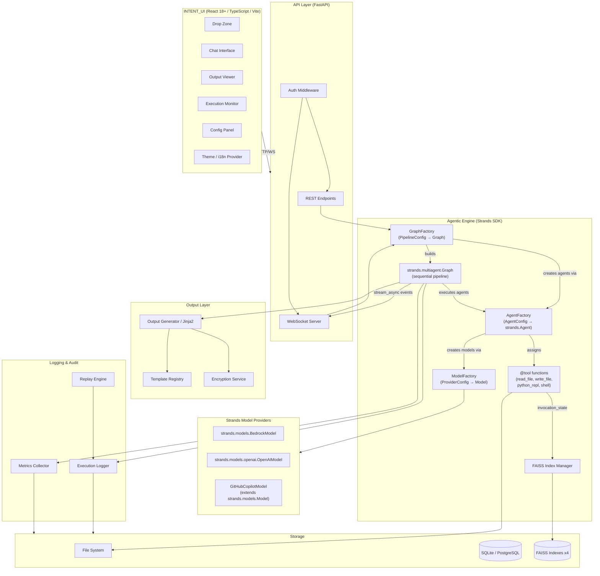

# Design Document — INTENT

## Overview

INTENT is a full-stack web application that transforms unstructured input documents into structured output documents through a configurable AI agentic pipeline. The system is composed of a React 18+ TypeScript frontend (INTENT_UI) and a Python FastAPI backend. Users submit files via drag-and-drop, interact through a bilingual chat interface, and receive generated documents rendered from configurable Jinja2 templates. The backend orchestrates a sequential chain of AI agents (AWS Strands Python SDK), each with its own LLM provider, tool access, and FAISS index bindings. Every execution step is logged for full traceability, replay, and audit compliance.

The design prioritizes configurability (pipeline, models, templates, encryption), extensibility (new agents, providers, tools), and auditability (structured JSON logs, metrics export, replay).

## Architecture

The system follows a layered client-server architecture with WebSocket streaming for real-time communication. The backend agentic engine is built entirely on the AWS Strands Python SDK, using its native `Agent`, `GraphBuilder`, model providers, and `@tool` abstractions.



### Communication Patterns

- **REST**: File upload, config CRUD, export, metrics download, auth
- **WebSocket**: `graph.stream_async()` forwards `multiagent_node_start`, `multiagent_node_stream`, `multiagent_node_stop`, and `multiagent_result` events to the frontend for real-time LLM streaming, live execution logs, and agent status updates. Chat messages also flow over WebSocket.
- **Internal**: `GraphFactory` translates `PipelineConfig` into a `strands.multiagent.Graph` with sequential topology. Each node is a `strands.Agent` instance created by `AgentFactory` with the correct Strands model provider, `@tool` functions, and system prompt. Tools access shared state (FAISS manager, session context) via `invocation_state`.

### Deployment

The application is containerized with Docker. Frontend and backend can run as separate containers behind a reverse proxy, or as a single compose stack for development.

## Components and Interfaces

### 1. INTENT_UI (Frontend)

**Technology:** React 18+, TypeScript, Vite, TailwindCSS, shadcn/ui, i18next, react-dropzone

**Responsibilities:**
- File drag-and-drop with format detection and preview
- Bilingual (EN/FR) chat interface with real-time streaming display
- Output document preview and export (PDF, XML, DOCX)
- Real-time execution timeline with agent status
- Pipeline configuration panel (admin only)
- Theme switching (dark/light) and language switching
- Authentication gate and RBAC enforcement on UI routes

**Key Sub-Components:**

| Component | Description |
|-----------|-------------|
| `DropZone` | Accepts files via drag-and-drop, validates formats (PPTX, DOCX, PDF, TXT, HTML, MD), shows preview |
| `ChatPanel` | Bilingual NL input, WebSocket message streaming, session context |
| `OutputViewer` | Renders document preview, export buttons for PDF/XML/DOCX |
| `ExecutionTimeline` | Real-time agent status (pending/running/completed/failed), live log stream |
| `ConfigPanel` | CRUD for Pipeline_Config: agent sequence, model assignments, tool access, FAISS bindings, templates |
| `ThemeProvider` | Dark/light theme toggle, OS preference detection |
| `I18nProvider` | i18next setup, browser language detection, manual switch |
| `AuthGate` | Login flow, token management, role-based route protection |
| `MetricsDashboard` | Real-time token/call counts per agent during execution |

**Interfaces (Frontend → Backend):**

```typescript
// File upload
POST /api/files/upload  → multipart/form-data → FileUploadResponse

// Chat
WS /api/ws/chat/{session_id} → ChatMessage ↔ ChatResponse (streamed)

// Pipeline execution
POST /api/pipeline/execute → PipelineExecuteRequest → PipelineExecuteResponse
WS /api/ws/execution/{session_id} → ExecutionEvent (streamed)

// Pipeline config
GET/POST/PUT/DELETE /api/config/pipelines → PipelineConfig

// Output
GET /api/output/{session_id}/preview → OutputPreview
GET /api/output/{session_id}/export?format={pdf|xml|docx} → binary

// Metrics
GET /api/metrics/{session_id} → SessionMetrics
GET /api/metrics/{session_id}/csv → CSV file

// Replay
GET /api/replay/{session_id} → ReplayData
GET /api/replay/{session_id}/step/{step_number} → ReplayStep

// Auth
POST /api/auth/login → AuthToken
GET /api/auth/me → UserProfile
```

### 2. File Ingestion Service

**Technology:** FastAPI, python-multipart, python-magic (format detection)

**Responsibilities:**
- Receive uploaded files via REST multipart
- Validate file format against allowed list (PPTX, DOCX, PDF, TXT, HTML, MD)
- Decrypt encrypted files using Encryption Service if configured
- Return descriptive errors for unsupported formats or upload failures
- Reject unauthenticated requests

**Interface:**

```python
class FileIngestionService:
    async def upload(self, files: list[UploadFile], session_id: str) -> list[IngestedFile]
    async def validate_format(self, file: UploadFile) -> FileValidationResult
    async def decrypt_if_needed(self, file: IngestedFile, config: EncryptionConfig) -> IngestedFile
```

### 3. Pipeline Orchestrator (GraphFactory)

**Technology:** AWS Strands Python SDK (`strands.multiagent.GraphBuilder`, `strands.Agent`), YAML/JSON parsing (PyYAML, json)

**Responsibilities:**
- Load and validate Pipeline_Config from YAML, JSON, or Strands Graph format
- Translate a `PipelineConfig` into a `strands.multiagent.Graph` with sequential topology using `GraphBuilder`
- Create `strands.Agent` instances for each node via `AgentFactory`
- Execute the graph, which handles sequential agent chaining (each agent's output flows to the next)
- Forward real-time events to frontend via WebSocket using `graph.stream_async()` events (`multiagent_node_start`, `multiagent_node_stream`, `multiagent_node_stop`, `multiagent_result`)
- Halt on agent failure with agent name, step number, and error details (graph returns `FAILED` status)
- Coordinate with Execution Logger and Metrics Collector per step using graph result metadata (`result.execution_order`, `result.accumulated_usage`, `result.execution_time`)

**Interface:**

```python
from strands import Agent
from strands.multiagent import GraphBuilder

class GraphFactory:
    """Translates PipelineConfig into a Strands Graph for execution."""

    def __init__(self, agent_factory: AgentFactory, logger: ExecutionLogger, metrics: MetricsCollector):
        self.agent_factory = agent_factory
        self.logger = logger
        self.metrics = metrics

    def build_graph(self, config: PipelineConfig, shared_state: dict) -> Graph:
        """Build a Strands Graph from PipelineConfig with sequential topology."""
        builder = GraphBuilder()

        # Create a strands.Agent for each agent in the pipeline config
        for i, agent_config in enumerate(config.agents):
            agent: Agent = self.agent_factory.create_agent(agent_config, shared_state)
            node_id = agent_config.name
            builder.add_node(agent, node_id)

            # Sequential edges: each agent feeds into the next
            if i > 0:
                prev_node_id = config.agents[i - 1].name
                builder.add_edge(prev_node_id, node_id)

        # Entry point is the first agent
        builder.set_entry_point(config.agents[0].name)
        builder.set_execution_timeout(config.execution_timeout or 600)
        return builder.build()

    async def execute(self, config: PipelineConfig, inputs: list[IngestedFile], session: Session) -> PipelineResult:
        """Execute the pipeline by building and running a Strands Graph."""
        shared_state = {
            "faiss_manager": self.faiss_manager,
            "session_id": session.id,
            "user_id": session.user_id,
            "input_files": inputs,
        }
        graph = self.build_graph(config, shared_state)
        result = graph(self._format_inputs(inputs), invocation_state=shared_state)
        return self._to_pipeline_result(result, session)

    async def stream_execute(self, config: PipelineConfig, inputs: list[IngestedFile], session: Session, websocket) -> PipelineResult:
        """Execute with streaming events forwarded to WebSocket."""
        shared_state = {
            "faiss_manager": self.faiss_manager,
            "session_id": session.id,
            "user_id": session.user_id,
            "input_files": inputs,
        }
        graph = self.build_graph(config, shared_state)

        async for event in graph.stream_async(self._format_inputs(inputs), invocation_state=shared_state):
            if event.get("type") == "multiagent_node_start":
                await websocket.send_json({"type": "agent_start", "agent_id": event["node_id"], "session_id": session.id})
                await self.logger.log_step(session.id, self._step_from_event(event, "running"))
            elif event.get("type") == "multiagent_node_stream":
                await websocket.send_json({"type": "llm_token", "agent_id": event["node_id"], "content": event.get("delta", "")})
            elif event.get("type") == "multiagent_node_stop":
                await websocket.send_json({"type": "agent_complete", "agent_id": event["node_id"], "session_id": session.id})
                self.metrics.record_from_node_result(session.id, event["node_id"], event.get("usage", {}))
            elif event.get("type") == "multiagent_result":
                return self._to_pipeline_result(event["result"], session)

    # Config parsing/serialization (unchanged responsibility)
    def parse_config(self, raw: str, format: str) -> PipelineConfig: ...
    def serialize_config(self, config: PipelineConfig, format: str) -> str: ...
    async def validate_config(self, config: PipelineConfig) -> ValidationResult: ...
```

### 4. LLM Router (ModelFactory)

**Technology:** Strands model providers (`strands.models.BedrockModel`, `strands.models.openai.OpenAIModel`), custom `GitHubCopilotModel` extending `strands.models.Model`, OAuth (GitHub Copilot)

**Responsibilities:**
- Create the appropriate Strands model provider instance based on `ProviderConfig`
- Support AWS Bedrock via `strands.models.BedrockModel`
- Support OpenAI-compatible endpoints (OpenAI, Azure OpenAI, Mistral API, vLLM, Ollama) via `strands.models.openai.OpenAIModel`
- Support GitHub Copilot via a custom `GitHubCopilotModel` that extends `strands.models.Model` with OAuth authentication
- Each `strands.Agent` gets its own model instance — no shared routing needed
- Return errors identifying the provider and connection failure reason

**Interface:**

```python
from strands.models import BedrockModel, Model
from strands.models.openai import OpenAIModel

class GitHubCopilotModel(Model):
    """Custom Strands model provider for GitHub Copilot via OAuth.
    Extends strands.models.Model, implements stream(), update_config(), get_config().
    """
    def __init__(self, oauth_config: OAuthConfig, model_id: str):
        self.oauth_config = oauth_config
        self.model_id = model_id
        self._token = None

    def stream(self, request): ...      # Implement streaming via Copilot API
    def update_config(self, **kwargs): ...
    def get_config(self) -> dict: ...

class ModelFactory:
    """Creates Strands model provider instances from ProviderConfig."""

    def create_model(self, provider_config: ProviderConfig) -> Model:
        """Create the appropriate Strands model provider based on config."""
        match provider_config.provider_type:
            case "bedrock":
                return BedrockModel(
                    model_id=provider_config.model_id,
                    region_name=provider_config.region,
                    temperature=provider_config.temperature,
                    max_tokens=provider_config.max_tokens,
                )
            case "openai_compatible":
                client_args = {"api_key": provider_config.api_key}
                if provider_config.endpoint:
                    client_args["base_url"] = provider_config.endpoint
                return OpenAIModel(
                    client_args=client_args,
                    model_id=provider_config.model_id,
                )
            case "github_copilot":
                return GitHubCopilotModel(
                    oauth_config=provider_config.oauth_config,
                    model_id=provider_config.model_id,
                )
            case _:
                raise ValueError(f"Unsupported provider type: {provider_config.provider_type}")

    async def check_provider_health(self, provider_config: ProviderConfig) -> HealthStatus:
        """Verify connectivity to the configured provider."""
        try:
            model = self.create_model(provider_config)
            # Attempt a minimal request to verify connectivity
            return HealthStatus(healthy=True, provider=provider_config.provider_type)
        except Exception as e:
            return HealthStatus(healthy=False, provider=provider_config.provider_type, error=str(e))
```

### 5. FAISS Index Manager

**Technology:** faiss-cpu (or faiss-gpu), sentence-transformers (for embeddings)

**Responsibilities:**
- Manage up to 4 concurrent FAISS indexes per pipeline execution
- Return document fragments ranked by similarity score
- Report errors for unavailable indexes

**Interface:**

```python
class FAISSIndexManager:
    async def load_indexes(self, index_configs: list[IndexConfig]) -> None
    async def query(self, index_id: int, query_text: str, top_k: int = 5) -> list[SimilarityResult]
    def get_loaded_indexes(self) -> list[int]
```

### 6. Agent Tools (@tool functions)

**Technology:** Strands `@tool` decorator, `ToolContext` with `invocation_state`, Python subprocess

**Responsibilities:**
- Provide file read, file write, Python REPL, and shell tools as Strands `@tool` decorated functions
- Access FAISS indexes and session context via `ToolContext.invocation_state` shared state
- Tool permissions are enforced by only passing permitted tools to each `strands.Agent()` — agents can only invoke tools they were given
- Denied tool attempts are logged when the `AgentFactory` filters tools based on `Pipeline_Config`
- Cross-platform: Python REPL on Win+Linux, Shell via Bash (Linux) or PowerShell (Windows)

**Interface:**

```python
from strands import tool, ToolContext

@tool
def read_file(path: str) -> str:
    """Read file contents from the local file system.
    Args:
        path: Path to the file to read
    """
    with open(path, 'r') as f:
        return f.read()

@tool
def write_file(path: str, content: str) -> str:
    """Write content to a file on the local file system.
    Args:
        path: Path to the file to write
        content: Content to write to the file
    """
    with open(path, 'w') as f:
        f.write(content)
    return f"Written {len(content)} bytes to {path}"

@tool
def python_repl(code: str) -> str:
    """Execute Python code and return the result. Works on both Windows and Linux.
    Args:
        code: Python code to execute
    """
    # Uses subprocess to execute in isolated environment
    ...

@tool
def shell(command: str) -> str:
    """Execute a shell command. Uses Bash on Linux and PowerShell on Windows.
    Args:
        command: Shell command to execute
    """
    ...

@tool(context=True)
def query_faiss(query: str, index_id: int, tool_context: ToolContext) -> str:
    """Query a FAISS index for similar documents.
    Args:
        query: The search query text
        index_id: The FAISS index to query (0-3)
    """
    faiss_manager = tool_context.invocation_state.get("faiss_manager")
    if faiss_manager is None:
        return "Error: FAISS manager not available"
    results = faiss_manager.query(index_id, query)
    return str(results)

# Tool registry for AgentFactory to select from
ALL_TOOLS = {
    "read": read_file,
    "write": write_file,
    "python_repl": python_repl,
    "shell": shell,
    "query_faiss": query_faiss,
}
```

### 7. AgentFactory

**Technology:** Strands `Agent` class, `ModelFactory`, `@tool` functions

**Responsibilities:**
- Create `strands.Agent` instances from `AgentConfig` with the correct model provider, tools, system prompt, and name
- Resolve the model provider via `ModelFactory` based on the agent's `ProviderConfig`
- Select only the permitted `@tool` functions for each agent based on `Pipeline_Config`
- Automatically include `query_faiss` tool for agents with FAISS index bindings
- Log denied tool access when an agent's config references tools not in the permitted set

**Interface:**

```python
from strands import Agent

class AgentFactory:
    """Creates strands.Agent instances from AgentConfig."""

    def __init__(self, model_factory: ModelFactory):
        self.model_factory = model_factory

    def create_agent(self, agent_config: AgentConfig, shared_state: dict) -> Agent:
        """Create a strands.Agent with the correct model, tools, and system prompt."""
        # Create the Strands model provider for this agent
        model = self.model_factory.create_model(agent_config.provider_config)

        # Select only permitted tools
        permitted_tools = []
        for tool_name in agent_config.tools:
            if tool_name in ALL_TOOLS:
                permitted_tools.append(ALL_TOOLS[tool_name])

        # Add query_faiss tool if agent has FAISS index bindings
        if agent_config.faiss_indexes:
            permitted_tools.append(ALL_TOOLS["query_faiss"])

        return Agent(
            model=model,
            tools=permitted_tools,
            system_prompt=agent_config.system_prompt or agent_config.description,
            name=agent_config.name,
        )
```

### 8. Template Registry & Output Generator

**Technology:** Jinja2, WeasyPrint (PDF), python-docx (DOCX), lxml (XML)

**Responsibilities:**
- Store and manage output templates (format, structure, validation rules, metadata, encryption settings)
- Render documents by applying Jinja2 templates to pipeline output data
- Validate rendered documents against template rules
- Include required metadata (author, date, version, classification)
- Encrypt output if configured

**Interface:**

```python
class TemplateRegistry:
    def get_template(self, template_id: str) -> Template
    def list_templates(self) -> list[TemplateSummary]
    def register_template(self, template: Template) -> None

class OutputGenerator:
    async def render(self, template_id: str, data: dict, metadata: DocumentMetadata) -> RenderedDocument
    async def validate(self, document: RenderedDocument, template: Template) -> ValidationResult
    async def export(self, document: RenderedDocument, format: str) -> bytes
```

### 9. Execution Logger

**Technology:** structlog or standard logging, JSON serialization

**Responsibilities:**
- Record per-step: timestamp (with timezone), agent ID, input data, prompts, LLM responses, decisions, output data
- Record authenticated user identity and LLM provider/model per agent per session
- Store logs in structured JSON to file system or database (SQLite/PostgreSQL)
- Record complete input files and final output documents per session
- Encrypt logs at rest if configured

**Interface:**

```python
class ExecutionLogger:
    async def log_step(self, session_id: str, step: ExecutionStep) -> None
    async def log_session_start(self, session_id: str, user_id: str, inputs: list[IngestedFile], config: PipelineConfig) -> None
    async def log_session_end(self, session_id: str, outputs: list[RenderedDocument]) -> None
    async def get_session_log(self, session_id: str) -> SessionLog
    async def list_sessions(self, filters: dict) -> list[SessionSummary]
```

### 10. Metrics Collector

**Technology:** In-memory counters, CSV export

**Responsibilities:**
- Record input tokens, output tokens, and LLM call count per agent per session
- Export metrics as CSV per session
- Provide real-time metrics via WebSocket during execution

**Interface:**

```python
class MetricsCollector:
    def record(self, session_id: str, agent_id: str, input_tokens: int, output_tokens: int) -> None
    def get_session_metrics(self, session_id: str) -> SessionMetrics
    def export_csv(self, session_id: str) -> str
```

### 11. Replay Engine

**Technology:** Reads from Execution Logger storage

**Responsibilities:**
- Load past execution from stored logs
- Present each step sequentially with recorded inputs, prompts, responses, outputs
- Support step-by-step navigation

**Interface:**

```python
class ReplayEngine:
    async def load_execution(self, session_id: str) -> ReplaySession
    async def get_step(self, session_id: str, step_number: int) -> ReplayStep
    def get_timeline(self, session_id: str) -> list[TimelineEntry]
```

### 12. Encryption Service

**Technology:** cryptography library (Fernet, AES-GCM)

**Responsibilities:**
- Configurable encryption/decryption for inputs, outputs, and logs independently
- Support different keys and algorithms per encryption target
- Decrypt input files on ingestion, encrypt outputs on generation, encrypt logs at rest

**Interface:**

```python
class EncryptionService:
    def encrypt(self, data: bytes, config: EncryptionConfig) -> bytes
    def decrypt(self, data: bytes, config: EncryptionConfig) -> bytes
    def get_config(self, target: str) -> EncryptionConfig  # target: "input" | "output" | "log"
```

### 13. Auth Service

**Technology:** FastAPI security, JWT, OAuth2

**Responsibilities:**
- Authenticate users before granting access
- Issue and validate JWT tokens
- Enforce RBAC: admin role for config/template/provider management, user role for file submission and pipeline execution

**Interface:**

```python
class AuthService:
    async def authenticate(self, credentials: LoginRequest) -> AuthToken
    async def validate_token(self, token: str) -> UserContext
    def has_role(self, user: UserContext, required_role: str) -> bool
```

## Data Models

### Pipeline Configuration

```python
@dataclass
class PipelineConfig:
    name: str
    agents: list[AgentConfig]
    output: OutputConfig
    execution_timeout: int = 600        # seconds, passed to GraphBuilder.set_execution_timeout()

@dataclass
class AgentConfig:
    name: str                           # maps to strands.Agent(name=...)
    model: str                          # shorthand e.g. "bedrock/claude-3-sonnet", "openai/gpt-4"
    provider_config: ProviderConfig     # resolved from model shorthand, used by ModelFactory
    description: str                    # used as system_prompt for strands.Agent
    system_prompt: str | None = None    # optional override; if set, used instead of description
    faiss_indexes: list[int] = field(default_factory=list)  # indexes this agent can query (0-3)
    tools: list[str] = field(default_factory=list)          # permitted tool names: "read", "write", "python_repl", "shell"
    template: str | None = None         # optional template binding for final agent

@dataclass
class OutputConfig:
    template: str                       # template ID from Template Registry
    formats: list[str]                  # e.g. ["xml", "pdf", "docx"]
```

### LLM Provider Configuration

```python
@dataclass
class ProviderConfig:
    provider_type: str                  # "bedrock" | "openai_compatible" | "github_copilot"
    model_id: str                       # model identifier passed to Strands model provider
    endpoint: str | None = None         # base_url for OpenAIModel client_args
    api_key: str | None = None          # encrypted API key; passed to OpenAIModel client_args or GitHubCopilotModel
    region: str | None = None           # region_name for BedrockModel
    temperature: float = 0.7            # passed to BedrockModel temperature or OpenAIModel config
    max_tokens: int = 2048              # passed to BedrockModel max_tokens
    oauth_config: OAuthConfig | None = None  # GitHub Copilot OAuth settings for GitHubCopilotModel

@dataclass
class OAuthConfig:
    client_id: str
    client_secret: str
    token_url: str
    scopes: list[str]
```

### File and Session Models

```python
@dataclass
class IngestedFile:
    id: str
    original_name: str
    format: str                         # "pptx" | "docx" | "pdf" | "txt" | "html" | "md"
    size_bytes: int
    content: bytes
    was_encrypted: bool
    session_id: str

@dataclass
class Session:
    id: str
    user_id: str
    pipeline_config_id: str
    status: str                         # "pending" | "running" | "completed" | "failed"
    created_at: datetime
    completed_at: datetime | None
    input_files: list[str]              # IngestedFile IDs
    output_documents: list[str]         # RenderedDocument IDs
```

### Execution and Logging Models

```python
@dataclass
class ExecutionStep:
    step_number: int
    agent_id: str
    agent_name: str
    status: str                         # "pending" | "running" | "completed" | "failed"
    timestamp: datetime                 # with timezone
    input_data: dict
    prompts_sent: list[str]
    llm_responses: list[str]
    llm_provider: str
    llm_model: str
    decisions: list[str]
    output_data: dict
    error: str | None

@dataclass
class SessionLog:
    session_id: str
    user_id: str
    pipeline_config: PipelineConfig
    steps: list[ExecutionStep]
    input_files: list[IngestedFile]
    output_documents: list[RenderedDocument]
    created_at: datetime
    completed_at: datetime | None

@dataclass
class SessionMetrics:
    session_id: str
    agent_metrics: list[AgentMetrics]

@dataclass
class AgentMetrics:
    agent_id: str
    agent_name: str
    input_tokens: int
    output_tokens: int
    llm_call_count: int
```

### Template and Output Models

```python
@dataclass
class Template:
    id: str
    name: str
    format: str                         # "xml" | "pdf" | "docx" | "md" | "html"
    structure: dict                     # section hierarchy definition
    validation_rules: list[ValidationRule]
    required_metadata: list[str]        # e.g. ["author", "date", "version", "classification"]
    encryption_settings: EncryptionConfig | None
    jinja2_template_path: str

@dataclass
class ValidationRule:
    field: str
    rule_type: str                      # "required" | "format" | "cross_reference" | "regex"
    parameters: dict

@dataclass
class RenderedDocument:
    id: str
    session_id: str
    template_id: str
    format: str
    content: bytes
    metadata: DocumentMetadata
    validation_result: ValidationResult

@dataclass
class DocumentMetadata:
    author: str
    date: datetime
    version: str
    classification: str
```

### Encryption Models

```python
@dataclass
class EncryptionConfig:
    enabled: bool
    algorithm: str                      # e.g. "AES-256-GCM", "Fernet"
    key_reference: str                  # reference to key in key store
    target: str                         # "input" | "output" | "log"
```

### Auth Models

```python
@dataclass
class UserContext:
    user_id: str
    username: str
    roles: list[str]                    # e.g. ["admin", "user"]
    token: str

@dataclass
class AuthToken:
    access_token: str
    token_type: str
    expires_in: int
    user_id: str
    roles: list[str]
```

### FAISS Models

```python
@dataclass
class IndexConfig:
    index_id: int                       # 0-3
    name: str
    description: str
    index_path: str                     # path to FAISS index file
    embedding_model: str                # model used for vectorization

@dataclass
class SimilarityResult:
    document_fragment: str
    score: float
    source_document: str
    index_id: int
```

### WebSocket Event Models

```typescript
// Frontend TypeScript types for WebSocket events
// These map from Strands graph.stream_async() event types to frontend-friendly events

interface ExecutionEvent {
  type: "agent_start" | "agent_complete" | "agent_fail" | "llm_token" | "log_entry" | "metrics_update" | "pipeline_complete";
  session_id: string;
  timestamp: string;
  data: AgentStatusData | LLMStreamToken | LogEntryData | MetricsData | PipelineCompleteData;
}

// Strands event mapping:
// multiagent_node_start  → agent_start
// multiagent_node_stream → llm_token
// multiagent_node_stop   → agent_complete (or agent_fail if error)
// multiagent_result      → pipeline_complete

interface ChatResponse {
  type: "token" | "complete" | "error";
  session_id: string;
  content: string;
}

interface AgentStatusData {
  agent_id: string;
  agent_name: string;
  step_number: number;
  status: "pending" | "running" | "completed" | "failed";
  error?: string;
}

interface LLMStreamToken {
  type: "token" | "complete";
  agent_id: string;
  content: string;
}

interface PipelineCompleteData {
  status: "COMPLETED" | "FAILED";       // from graph result.status
  execution_order: string[];             // from result.execution_order
  execution_time_ms: number;             // from result.execution_time
  total_tokens: { input: number; output: number };  // from result.accumulated_usage
}
```

### File Validation

```python
SUPPORTED_FORMATS = {"pptx", "docx", "pdf", "txt", "html", "md"}

@dataclass
class FileValidationResult:
    valid: bool
    detected_format: str | None
    error_message: str | None
```

## Correctness Properties

*A property is a characteristic or behavior that should hold true across all valid executions of a system — essentially, a formal statement about what the system should do. Properties serve as the bridge between human-readable specifications and machine-verifiable correctness guarantees.*

### Property 1: File format acceptance matches supported set

*For any* file with a detected format, the File_Ingestion_Service should accept the file if and only if its format is in the set {PPTX, DOCX, PDF, TXT, HTML, MD}. Files with formats outside this set should be rejected with an error message identifying the unsupported format.

**Validates: Requirements 1.2, 1.4**

### Property 2: File preview renders for each dropped file

*For any* list of valid files dropped onto the drop zone, the UI should render a preview element for each file that includes the file's detected format.

**Validates: Requirements 1.3**

### Property 3: Chat session context accumulation

*For any* sequence of N messages sent within a single session, the conversation context should contain all N messages in order.

**Validates: Requirements 2.4**

### Property 4: Pipeline agent output chaining

*For any* pipeline configuration with agents [A1, A2, ..., AN], when executed, agent Ai+1's input should equal agent Ai's output for all i in 1..N-1.

**Validates: Requirements 3.1, 3.2**

### Property 5: Pipeline failure halts and reports

*For any* pipeline where agent at step K fails, execution should halt at step K and the error report should contain the agent name, step number K, and error details. No agents after step K should execute.

**Validates: Requirements 3.4**

### Property 6: Pipeline accepts any positive agent count

*For any* positive integer N, a pipeline configuration with N agents should be accepted and executable by the Pipeline_Orchestrator.

**Validates: Requirements 3.5**

### Property 7: LLM routing matches agent configuration

*For any* agent configured with provider P and model M in the Pipeline_Config, the LLM_Router should route that agent's requests to provider P with model M.

**Validates: Requirements 4.1**

### Property 8: Unreachable LLM provider error identification

*For any* LLM provider that is unreachable, the LLM_Router should return an error that identifies the provider name and the connection failure reason.

**Validates: Requirements 4.5**

### Property 9: FAISS index count constraint

*For any* pipeline configuration, the FAISS_Index_Manager should accept configurations with 1 to 4 indexes and reject configurations requesting more than 4 indexes.

**Validates: Requirements 5.1**

### Property 10: FAISS similarity results are ranked by score

*For any* query to a FAISS index, the returned document fragments should be ordered by descending similarity score.

**Validates: Requirements 5.3**

### Property 11: File read/write round trip

*For any* byte content and file path, writing the content via the file write tool and then reading it via the file read tool should return the original content.

**Validates: Requirements 6.1, 6.2**

### Property 12: Python REPL correctness

*For any* valid Python expression, the Python REPL tool should return the correct evaluation result.

**Validates: Requirements 6.3**

### Property 13: Tool permission enforcement

*For any* agent with permitted tools P and any tool T not in P, invoking T should be denied and the denied attempt should be logged.

**Validates: Requirements 6.6**

### Property 14: Template completeness

*For any* template stored in the Template_Registry, it should contain all required fields: output format, document structure, validation rules, required metadata, and optional encryption settings. For any generated document, the required metadata (author, date, version, classification) should be present.

**Validates: Requirements 7.1, 7.5**

### Property 15: Jinja2 template rendering produces output

*For any* valid template and valid pipeline output data, the Output_Generator should produce a non-empty rendered document.

**Validates: Requirements 7.3**

### Property 16: Validation failure reports violated rules

*For any* rendered document that violates one or more template validation rules, the Output_Generator should report exactly which rules were violated.

**Validates: Requirements 7.4**

### Property 17: Export format matches request

*For any* valid session and requested export format (PDF, XML, DOCX), the Output_Generator should produce a document in the requested format.

**Validates: Requirements 8.3**

### Property 18: Execution log completeness

*For any* pipeline execution step, the log entry should contain: timestamp with timezone, agent identifier, input data, prompts sent, LLM responses, agent decisions, output data, authenticated user identity, and LLM provider/model identifier. For any session, the log should associate input files, processing steps, and output documents within a single session record.

**Validates: Requirements 9.1, 18.1, 18.2, 18.3, 18.4**

### Property 19: Execution logs are valid JSON

*For any* log entry produced by the Execution_Logger, it should be parseable as valid JSON.

**Validates: Requirements 9.2**

### Property 20: Session logs include input and output documents

*For any* completed session, the session log should contain the complete input files and final output documents.

**Validates: Requirements 9.4**

### Property 21: Replay preserves execution data

*For any* completed session, loading the replay should present all pipeline steps in sequential order, and each step should contain the same inputs, prompts, responses, and outputs as originally recorded.

**Validates: Requirements 10.1, 10.2**

### Property 22: Metrics recording and CSV export round trip

*For any* session with agent executions, the Metrics_Collector should record input tokens, output tokens, and LLM call count per agent. Exporting as CSV and parsing the CSV should yield the same metric values that were recorded.

**Validates: Requirements 11.1, 11.2**

### Property 23: Encryption round trip per target

*For any* data (input file, output document, or log entry) and any encryption configuration, encrypting then decrypting should return the original data. Each target (input, output, log) should use its own independently configured key and algorithm.

**Validates: Requirements 12.1, 12.2, 12.3, 12.4, 12.5**

### Property 24: Pipeline config validation reports specific errors

*For any* Pipeline_Config with invalid settings, the Pipeline_Orchestrator should report specific validation errors identifying the invalid fields before execution begins.

**Validates: Requirements 14.3, 14.4**

### Property 25: UI preference changes preserve session state

*For any* session state, switching language (EN↔FR) or theme (dark↔light) should preserve all non-preference session state (uploaded files, chat history, execution results).

**Validates: Requirements 15.3, 16.2**

### Property 26: Pipeline config serialization round trip

*For any* valid PipelineConfig object, serializing to YAML (or JSON) then parsing back should produce an equivalent PipelineConfig object. Additionally, parse(serialize(parse(raw))) should equal parse(raw) for any valid raw config string.

**Validates: Requirements 19.1, 19.2, 19.3, 19.4**

### Property 27: Invalid config parsing error specificity

*For any* invalid Pipeline_Config file, the parser should return an error identifying the location and nature of the parsing failure.

**Validates: Requirements 19.5**

### Property 28: Unauthenticated request rejection

*For any* unauthenticated request to a protected endpoint (file upload, pipeline execution, or any application feature), the system should reject the request.

**Validates: Requirements 20.1, 20.2, 20.3**

### Property 29: Role-based access control enforcement

*For any* user without the administrator role, attempts to modify Pipeline_Config, LLM provider settings, or template configurations should be denied. For any user with the administrator role, such modifications should be allowed.

**Validates: Requirements 20.4**

## Error Handling

### Error Categories

| Category | Source | Handling Strategy |
|----------|--------|-------------------|
| File Format Error | File_Ingestion_Service | Return 400 with unsupported format name. UI displays inline error on the drop zone. |
| File Upload Failure | File_Ingestion_Service | Return 500 with descriptive cause (disk full, permission denied, etc.). UI shows toast notification. |
| Decryption Failure | Encryption_Service | Return 400 with "decryption failed" and target identifier. Pipeline does not start. |
| Pipeline Config Invalid | GraphFactory | Return 422 with list of specific validation errors (field name, expected vs actual). UI highlights invalid fields in config panel. |
| Pipeline Config Parse Error | GraphFactory | Return 422 with error location (line/column for YAML/JSON) and nature of failure. |
| Agent Execution Failure | Strands Graph (`result.status == FAILED`) | Graph halts at the failed node. `result.results[node_id]` contains the error. GraphFactory translates to error with agent name, step number, and error details. UI updates timeline to show failed step. |
| LLM Provider Unreachable | ModelFactory / Strands Model Provider | Strands model provider raises connection error. Caught during `graph.stream_async()` as a `multiagent_node_stop` event with error. GraphFactory forwards error identifying provider name and connection failure reason. |
| LLM Response Error | Strands Model Provider | Model provider raises error with provider, model, and error message. Logged by Execution Logger. |
| FAISS Index Unavailable | FAISS_Index_Manager (via `@tool` `invocation_state`) | `query_faiss` tool returns error string identifying the missing index ID and name. Agent decides whether to fail or continue. |
| Tool Permission Denied | AgentFactory (tool filtering) | Tool not included in `Agent(tools=[...])` — agent cannot invoke it. AgentFactory logs when a configured tool name is not in the permitted set. |
| Tool Execution Failure | `@tool` function | Tool function raises exception or returns error string. Strands Agent handles tool errors and decides whether to retry or fail. |
| Template Validation Failure | Output_Generator | Return list of violated validation rules (field, rule type, expected value). UI displays validation report. |
| Authentication Failure | Auth Service | Return 401. UI redirects to login. |
| Authorization Failure | Auth Service | Return 403. UI displays "access denied" message. |
| WebSocket Disconnection | API Layer | Auto-reconnect with exponential backoff. Buffer missed `stream_async` events and replay on reconnect. |

### Error Response Format

All REST API errors follow a consistent JSON structure:

```json
{
  "error": {
    "code": "PIPELINE_AGENT_FAILURE",
    "message": "Agent 'content_generator' failed at step 3",
    "details": {
      "agent_name": "content_generator",
      "step_number": 3,
      "cause": "LLM provider timeout after 30s",
      "graph_status": "FAILED",
      "execution_order": ["context_analyzer", "structure_builder", "content_generator"]
    },
    "timestamp": "2026-03-15T14:30:00Z",
    "session_id": "abc-123"
  }
}
```

### Error Propagation

1. Strands Graph errors surface via `result.status == FAILED` and per-node `result.results[node_id]`
2. During streaming, errors arrive as `multiagent_node_stop` events with error details, forwarded to WebSocket as `agent_fail` events
3. The Execution Logger records all errors as part of the execution trace
4. The frontend displays errors contextually (inline for validation, toast for transient, modal for fatal)

## Testing Strategy

### Dual Testing Approach

The INTENT application uses both unit tests and property-based tests for comprehensive coverage:

- **Unit tests** verify specific examples, edge cases, integration points, and error conditions
- **Property-based tests** verify universal properties across randomly generated inputs
- Both are complementary: unit tests catch concrete bugs, property tests verify general correctness

### Property-Based Testing Configuration

- **Library (Python backend):** Hypothesis
- **Library (TypeScript frontend):** fast-check
- **Minimum iterations:** 100 per property test
- **Tag format:** Each property test must include a comment: `# Feature: intent, Property {number}: {property_text}`

Each correctness property from the design document must be implemented by a single property-based test. The test must reference the property number and description.

### Backend Testing (Python / pytest + Hypothesis)

| Test Area | Type | Properties Covered |
|-----------|------|-------------------|
| File format validation | Property | Property 1 |
| Pipeline config round-trip | Property | Property 26 |
| Pipeline output chaining | Property | Property 4 |
| Pipeline failure handling | Property | Property 5 |
| Pipeline agent count | Property | Property 6 |
| LLM routing | Property | Property 7 |
| FAISS index constraint | Property | Property 9 |
| FAISS result ordering | Property | Property 10 |
| File read/write round trip | Property | Property 11 |
| Python REPL correctness | Property | Property 12 |
| Tool permission enforcement | Property | Property 13 |
| Template completeness | Property | Property 14 |
| Jinja2 rendering | Property | Property 15 |
| Validation error reporting | Property | Property 16 |
| Export format matching | Property | Property 17 |
| Log completeness | Property | Property 18 |
| Log JSON validity | Property | Property 19 |
| Session log content | Property | Property 20 |
| Replay data preservation | Property | Property 21 |
| Metrics CSV round trip | Property | Property 22 |
| Encryption round trip | Property | Property 23 |
| Config validation errors | Property | Property 24 |
| Config parse error specificity | Property | Property 27 |
| Auth rejection | Property | Property 28 |
| RBAC enforcement | Property | Property 29 |
| LLM provider error | Property | Property 8 |
| Bedrock provider support | Unit | Req 4.2 |
| OpenAI-compatible support | Unit | Req 4.3 |
| GitHub Copilot support | Unit | Req 4.4 |
| FAISS index unavailable | Unit | Req 5.4 |
| File upload failure errors | Unit | Req 1.5 |
| Storage backend support | Unit | Req 9.3 |
| Template format support | Unit | Req 7.2 |

### Frontend Testing (TypeScript / Vitest + fast-check)

| Test Area | Type | Properties Covered |
|-----------|------|-------------------|
| File preview rendering | Property | Property 2 |
| Chat context accumulation | Property | Property 3 |
| UI preference state preservation | Property | Property 25 |
| Drop zone renders | Unit | Req 1.1 |
| Chat accepts EN/FR | Unit | Req 2.1 |
| Language detection/selection | Unit | Req 2.2 |
| Output preview renders | Unit | Req 8.1 |
| Export buttons present | Unit | Req 8.2 |
| Execution timeline renders | Unit | Req 10.3, 13.1 |
| Config panel renders | Unit | Req 14.1, 14.2 |
| EN/FR language support | Unit | Req 15.1 |
| Browser language detection | Unit | Req 15.2 |
| Dark/light theme support | Unit | Req 16.1 |
| OS theme detection | Unit | Req 16.3 |

### Integration Tests

- End-to-end pipeline execution with mock LLM providers
- WebSocket streaming verification (chat + execution events)
- File upload → pipeline execution → output generation flow
- Authentication and authorization flow
- Encryption/decryption across the full pipeline

### Test Organization

```
tests/
├── backend/
│   ├── unit/
│   │   ├── test_file_ingestion.py
│   │   ├── test_pipeline_orchestrator.py
│   │   ├── test_llm_router.py
│   │   ├── test_faiss_manager.py
│   │   ├── test_tool_executor.py
│   │   ├── test_template_registry.py
│   │   ├── test_output_generator.py
│   │   ├── test_execution_logger.py
│   │   ├── test_metrics_collector.py
│   │   ├── test_replay_engine.py
│   │   ├── test_encryption_service.py
│   │   └── test_auth_service.py
│   ├── property/
│   │   ├── test_file_format_property.py          # Property 1
│   │   ├── test_pipeline_chaining_property.py     # Property 4
│   │   ├── test_pipeline_failure_property.py      # Property 5
│   │   ├── test_pipeline_agent_count_property.py  # Property 6
│   │   ├── test_llm_routing_property.py           # Property 7
│   │   ├── test_llm_error_property.py             # Property 8
│   │   ├── test_faiss_constraint_property.py      # Property 9
│   │   ├── test_faiss_ranking_property.py         # Property 10
│   │   ├── test_file_roundtrip_property.py        # Property 11
│   │   ├── test_repl_property.py                  # Property 12
│   │   ├── test_tool_permission_property.py       # Property 13
│   │   ├── test_template_property.py              # Property 14
│   │   ├── test_rendering_property.py             # Property 15
│   │   ├── test_validation_property.py            # Property 16
│   │   ├── test_export_format_property.py         # Property 17
│   │   ├── test_log_completeness_property.py      # Property 18
│   │   ├── test_log_json_property.py              # Property 19
│   │   ├── test_session_log_property.py           # Property 20
│   │   ├── test_replay_property.py                # Property 21
│   │   ├── test_metrics_csv_property.py           # Property 22
│   │   ├── test_encryption_roundtrip_property.py  # Property 23
│   │   ├── test_config_validation_property.py     # Property 24
│   │   ├── test_config_roundtrip_property.py      # Property 26
│   │   ├── test_config_parse_error_property.py    # Property 27
│   │   ├── test_auth_rejection_property.py        # Property 28
│   │   └── test_rbac_property.py                  # Property 29
│   └── integration/
│       ├── test_pipeline_e2e.py
│       ├── test_websocket_streaming.py
│       └── test_auth_flow.py
├── frontend/
│   ├── unit/
│   │   ├── DropZone.test.tsx
│   │   ├── ChatPanel.test.tsx
│   │   ├── OutputViewer.test.tsx
│   │   ├── ExecutionTimeline.test.tsx
│   │   ├── ConfigPanel.test.tsx
│   │   ├── ThemeProvider.test.tsx
│   │   └── I18nProvider.test.tsx
│   └── property/
│       ├── filePreview.property.test.ts           # Property 2
│       ├── chatContext.property.test.ts            # Property 3
│       └── uiPreference.property.test.ts          # Property 25
```
